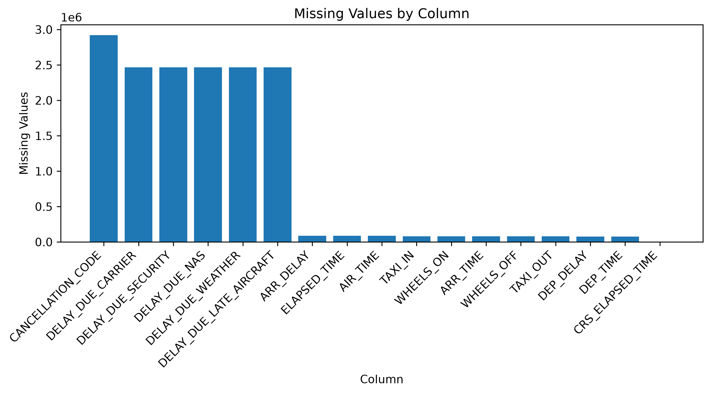
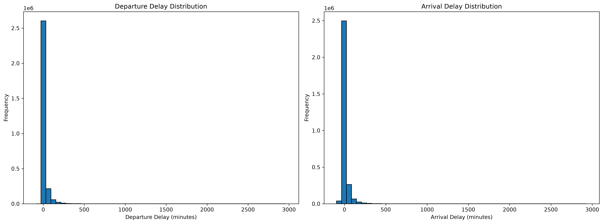
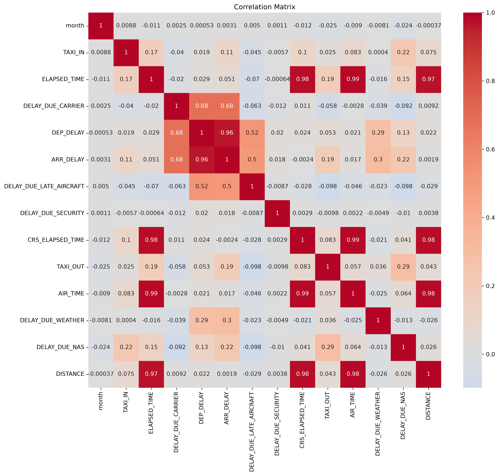
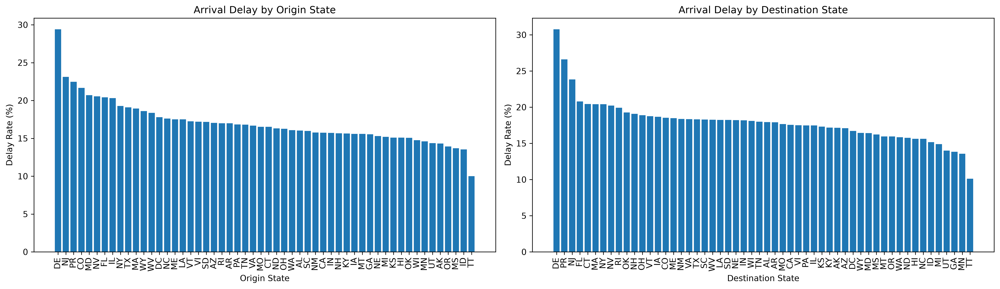
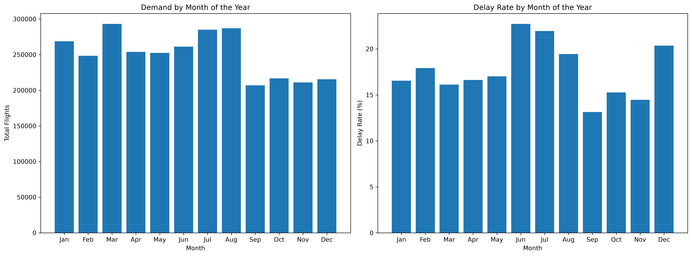
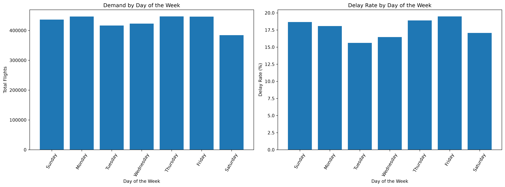
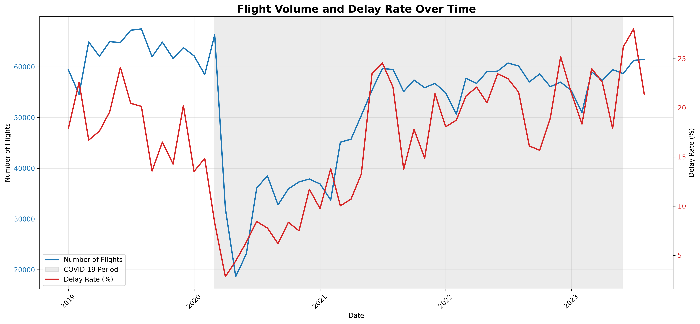

# Exploratory Data Analysis

Initially, a chart was created to show the columns containing missing values.

  

It can be observed that many columns do not contain null values and that, among those that do, only a few account for most of the missing values. In the columns starting from `ARR_DELAY` in the chart, many of the missing values are related to canceled flights, which are not relevant to this project, making their potential subsequent treatment easier.

Next, checks for inconsistencies in the data were performed. A grouping was performed using all possible columns indicating the airlines (`AIRLINE`, `AIRLINE_DOT`, `AIRLINE_CODE`, and `DOT_CODE`), and the number of flights for each was counted, with the purpose of identifying any duplication in data that should represent the same attribute. No issues were found. A similar procedure was then performed with airports (`ORIGIN` and `DEST`) and cities (`ORIGIN_CITY` and `DEST_CITY`) to check for duplicates. Some cities were repeated because they have more than one airport, but there was one case in which an airport appeared in two different cities. This error occurred because, in one of the cases, the city name was written entirely in uppercase letters.

Finally, taking advantage of the fact that the cities included their state abbreviations, the geographic coverage of the data was checked to ensure that there were no locations outside the United States. This check used auxiliary lists containing the state abbreviations, and the city columns were examined for missing or extra states.

  

In addition to the 50 states and the capital, the territories of Puerto Rico, the U.S. Virgin Islands, and the Trust Territories are present in the dataset.

Using the departure and arrival delay columns, the distributions of this variable were plotted, with particular focus on arrival delays, which are the target of this study.

  

This distribution indicates that the dataset is highly imbalanced, which may require specific parameters during modeling.

The correlation between numerical variables was measured. A very strong correlation was observed, as expected, between distance and actual and scheduled flight times. The relationship between departure and arrival delays is also very strong, suggesting that many delay-related problems occur at the departure airport or in its surrounding region. There is also a moderate correlation between delays and the reasons for delays. The large number of missing values in these columns may have weakened the correlation.

  

Initially, the states with the highest absolute number of delays were measured, but the results were dominated by the states containing the country's largest metropolitan areas, suggesting that this is not a very useful metric because the outcome is largely predictable. Therefore, the delay rate was analyzed for both arrivals and departures.

  

Regarding dates, charts showing flight volume and delay rate by month and day of the week were created. 

  
  

The months with the highest number of delays were June, July, and December, raising the hypothesis that summer congests airports, with August coming shortly after. December also has a high delay rate, possibly due to end-of-year celebrations. Interestingly, the month with the highest demand is March, and its delay rate is considerably lower than that of the worst-performing months.

Finally, since the COVID-19 pandemic covers a significant portion of the data, a chart with time series for flight volume and delay rate was created, standing out negatively due to the high irregularity of the data. A sharp decline can be observed at the beginning of 2020, followed by a recovery throughout the following year. Delays became more frequent after the health crisis, with the rate approaching and even exceeding the demand on the figure's scale.

  

Additional figures are available in `images/eda`.