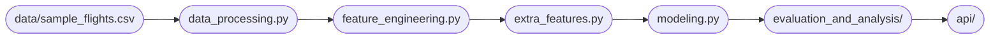

# **Machine Learning Pipeline**

This directory contains the complete machine learning pipeline.

Each script is responsible for one stage of the project.

## **Pipeline**

## **Scripts**

#### **`create_sample.py`**

This script reads the original dataset and generates a random sample of it with 10,000 rows.

Since the original dataset could not be stored in the repository due to its size, this script was created to provide a sample dataset for experiment reproducibility, although the [link to the original dataset](https://www.kaggle.com/datasets/patrickzel/flight-delay-and-cancellation-dataset-2019-2023/data) is provided.

The sample dataset is stored at `data/sample_flights.csv`.

#### **`config.py`**

This script stores core modeling information for the pipeline.

The dataset path, target variable, feature lists by category, test size, and `random_state` are stored in this file, so it is only necessary to change it instead of changing several scripts. This also prevents mistakes caused by changing one script and forgetting the others.

#### **`data_processing.py`**

The data processing stage reads the original dataset and transforms its data.

The city of Concord, in North Carolina, was written in two different forms in the dataset (Concord, NC and CONCORD, NC). The latter was changed to match the former.

During the EDA process, it was discovered that most of the missing values were related to information that was not useful for this project, so they were removed.

First of all, cancelled flights were registered, and they provide no information on route delays, so they were removed and their columns dropped. The geographical coverage revealed the presence of an obsolete territory (TT), so no more flights are scheduled from it, causing its airports to be removed from the dataset as well.

Along with these rows, several columns in the dataset were not usable for delay prediction, since they carried information regarding flight performance that is only available after the flight. These columns were dropped from the dataset, and most of the missing values were in them, so they were removed as well.

The remaining null values represented an insignificant percentage of the total data, so it was decided to remove them instead of applying different treatment techniques.

Despite all the data removal, the final dataset had over 2.9 million rows. It was saved for the next step.

#### **`feature_engineering.py`**

The feature engineering script receives the dataframe processed during last stage and create new columns in it.

The first and most important of them is `is_delayed`, a classifier that indicates if the arrival delay as greater than or equal to 15 minutes. This metric is used by the original source to indicate whether a flight delayed or not and it is the target variable.

Geographical features were created to help the model understand regional patterns of distance and delay. There were 6 feature creations, half of them for the origin airport and the other half for the destination airport. The features were:
- state: which state is the airport located in;
- division: which [US Census divison](https://www2.census.gov/geo/pdfs/maps-data/maps/reference/us_regdiv.pdf) the airport is in;
- contiguous indicator: it indicates if the airport is within the 48 contiguous states plus the federal capital, bordered by Canada and Mexico.

The flight distance was presented at the original dataset, was kept, and was used to create a nominal distance category following [the IATA classification](https://www.iata.org/en/iata-repository/publications/economic-reports/regional-air-connectivity-in-the-united-states/).

Also available in the original data, the scheduled departure and arrival times, previously converted to their proper types, were used to create `crs_departure_minutes` and `crs_arrival_minutes`. These features used their respective times to convert them into minutes, transforming 10:30 a.m. into the integer 630, for example. Also, they were in the same metric as `CRS_ELAPSED_TIME` after the transformation.

Flight date column was the source of 4 different features: `year`, `month`, `day_of_week` and a holiday classifier, which used only federal holidays to evaluate the date. This allowed the model to learn from periodic patterns, like the busiest days and most congested months.

Finally, the recently created `month` column was used to classify its data into one of the four seasons of the year. Meteorological  season metrics were used.

The final dataset was saved for use in the modeling step.

#### **`extra_features.py`**

After the first round of training, it was decided to add new features to help the models learn. All of these features are rate-based and are created through the functions defined in the script. Some functions are able to create more than one feature by changing their arguments.

The first function was responsible for creating the historical average delay rate for the flight route. The second function can create 3 different features, but only one per use. The delay rates it can create are: by origin airport, by destination airport, and by airline. The last function used the origin airport, day of the week, and a time metric (30 or 60 minutes) to calculate the congestion rate at the airport. It can create the rate using total flights, average airport flights, or normalized mean.

These metrics added more historical data for different parts of the flight. The route delay rate and the airport and airline delay rates were added to the model one by one, but none of the previously added rates were removed, so 5 more features were created after some training. To avoid adding three correlated features, the airport congestion rates were added, trained, and replaced one another. All the possible congestion rates were trained alongside all of the other rates created by this script.

To avoid data leakage, these new features were not added to the featured dataset.

#### **`modeling.py`**

This script runs the pipeline using parameters from several other scripts, besides adding every model training to [DagsHub](https://dagshub.com/bruno-vdc/flight-delay-prediction) and [MLflow](https://dagshub.com/bruno-vdc/flight-delay-prediction.mlflow/#/experiments).

It reads the featured dataset from `feature_engineering.py`, keeps only the necessary columns, splits the data into training and test datasets, allows features to be removed, adds features from `extra_features.py`, encodes the features, trains the model, evaluates it, and registers its parameters and metrics in DagsHub and MLflow.

By repeating the model training at the end of the script, more than one model can be trained at once, while results and experiment logs are generated for each one of them.

Although lots of tasks are performed, most of them come from other scripts. The model fitting parameters come from `config.py`, as well as the path to the featured dataset. The functions for the new features come from `extra_features.py`, but they are added here, after splitting, to avoid data leakage. The model training algorithms and their parameters come from the scripts in `scripts/models`, and the evaluation metrics come from `scripts/evaluation and analysis/model_evaluation.py`.

In this script only, there are the encoders and the possibility of deleting features before model training. To remove a feature, its name must be written in the `EXCLUDED_FEATURES` list, located right after fitting. The encoders are applied after the addition and/or removal of features, and are separated into three different types:

- ordinal encoder: it adds ordinal values to string-type categories. Currently, only `distance_category` has this characteristic;
- one-hot encoder: it transforms categorical features into vectors, so they can be used for calculations;
- standard scaler: it standardizes numerical features to eliminate high variability among them.

#### **`scripts/api`**

This directory stores the REST API scripts.

#### **`scripts/evaluation and analysis`**

It stores model evaluation metrics and SHAP analysis scripts.

#### **`scripts/models`**

It stores every model algorithm, which contains model hyperparameters and training functions.

## **Reproducibility**

This study is easily reproducible by using `data/sample_flights.csv`. However, using [the original dataset](https://www.kaggle.com/datasets/patrickzel/flight-delay-and-cancellation-dataset-2019-2023/data), which is not stored in this repository due to its size, is a better option.

All libraries and their versions are listed in `requirements.txt`. Also, a specific requirements list can be found in `scripts/evaluation and analysis/README.md`, and it was the one used to run `scripts/evaluation and analysis/shap_analysis.ipynb`. The different versions were necessary due to incompatibility issues between the SHAP and NumPy libraries.