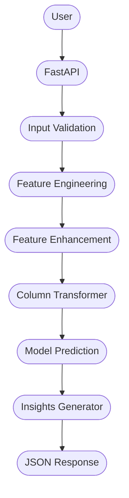

# **Flight Delay Prediction API**

## **Overview**

While flight delay prediction models are usually evaluated in notebooks or scripts, this API exposes the final trained model through a REST interface, allowing future flight information to be submitted and returning both the predicted delay probability and additional operational insights to guide decision-making for flight operations scheduling or ticket purchasing.

## **Architecture**



## **Prediction Pipeline**

The API's prediction follows this pipeline:

**1.** The user sends airline, origin airport, destination airport, flight date, departure time and arrival time.

**2.** API validates these data by checking the flight date, which might between tomorrow and one year in the future. Past dates triggers an error message, just like a longer-than-one-year date.

**3.** Features are created to improve prediction abilities. Highlighted features are: year, month, day of the week, season of the year, and flight times conversion to minutes format.

**4.** Historical features are generated. The main ones are rates for route delay and airline delay.

**5.** The trained XGBoost encodes the features and predicts the probability of delay.

**6.** API generates extra insights such as the expected airport congestion and distance complexity for the operation to support decision-making.

**7.** A JSON response is returned with probability, delay risk classification, insights and a warming regarding trained data limitations.

## **Input and Output**

#### **Input**

As input data, 6 information are required under specific rules:

- `AIRLINE_CODE` refers to the code used by IATA;
- `ORIGIN` and `DEST` are origin IATA airport code and destination IATA airport code, respectively;
- `FL_DATE` must follow `YYYY-MM-DD` format;
- `CRS_DEP_TIME` and `CRS_ARR_TIME` are scheduled departure and arriving times, respectively. They must follow `HH:MM` format;
- Every information must be input between double quotes.

Based on an actual sheduled flight, this is an input example:
```json
{
  "AIRLINE_CODE": "AA",
  "ORIGIN": "EWR",
  "DEST": "ORD",
  "FL_DATE": "2026-08-06",
  "CRS_DEP_TIME": "05:29",
  "CRS_ARR_TIME": "07:15"
}
```
#### **Output**

Inputting the previous example, that's the API response:
```json
{
  "delay_probability": 30.59,
  "risk": "Moderate Risk",
  "insights": [
    "This route has a historically high delay rate.",
    "This airline has a higher historical delay rate.",
    "Historical data indicate that flights departing from this airport experience above-average delays."
  ],
  "warning": "Prediction generated for a year outside the training period (2019-2023). Interpret the result with caution."
}
```

- `delay_probability` is the percentage of delay predicted by the trained model;
- `risk` is a categorical classification of `delay_probability`;
- `insights` are historical-based problems that use to happen to this route;
- `warning` is a caution message to inform data limitations.

Both `risk` and `insights` are defined using quartiles percentages.

There are four possible `risk` classifications: Lower Risk, Moderate Risk, Elevated Risk, and Highest Risk. The returned classification is determined by the quartile of the calculated probability.

The `insights` field uses similar approach. During prediction, the request data rates are calculated and compared with those of the training dataset. Training dataset rates are also divided into quartiles, and an insight is generated whenever a request data rate falls within the 4th quartile, meaning it is higher than 75% of the training data. There are 8 different rates that can generate insights, all of which are based on the project's features. The following rates are compared in the order listed below, which reflects the actual comparison order:

- `normalized_departure_congestion`;
- `route_delay_rate`;
- `airline_delay_rate`;
- `DISTANCE`;
- `CRS_ELAPSED_TIME`;
- `origin_delay_rate`;
- `dest_delay_rate`;
- `season`

The generated insights are stored in a list, and after all comparisons are completed, only the first 3 of them are retained. That keeps an user-friendly interface while provides valuable information to support the decision-making process, which ultimately remains the user's responsibility. The API only offers a data-drivem guidance, not a final decision.

## **Limitations**

There are some limitations to the API:

- trained with data from 2019–2023, which includes COVID-19 pandemic;
- predictions requires cautions since they use future dates;
- important weather information is unavailable.

## **Future Improvements**

In order to keep the API reliable and continuously improve its prediction abilities, periodic maintenance and validation activities can be carried out, such as:

- integration with weathers APIs;
- data drift monitoring;
- periodic model retraining;
- Probability calibration improvements. 