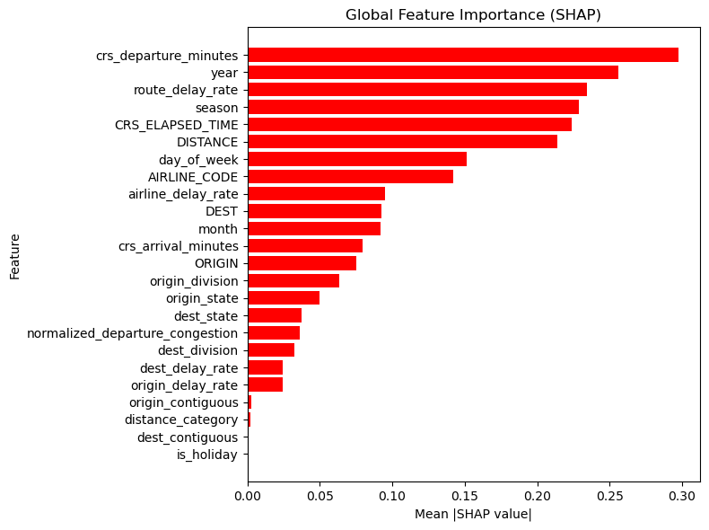

# **SHAP Analysis**

Besides its primary model interpretation functions, SHAP analysis led to new models training by removing least important features and even testing new hypothesis with one of the most important features removed.

## **Model Interpretability**

SHAP values were used not only to rank feature importance, but also to quantify each feature's contribution to the model output, which is a difficult task when working with gradient boosting models.

XGBoost with all trained features until this point was considered the best model beacuse of its f1 score, recall score, low experiment time duration and, since features will be availed, it has of all them. These are its metrics.

| Model | Name | Accuracy | F1 Score | Precision | Recall |
| :--- | :--- | :--- | :--- | :--- | :--- |
| XGBoost | Reference Model | 0.667974 | 0.403753 | 0.300882 | 0.613511 |

As the chosen model was a tree-like one, SHAP values were calculated by using the `TreeExplainer()` method at the model and then at the test set. The result was how important each one out of the 926 features (after one-hot encoding) were.

## **Feature Importance**

A dataframe containing the feature names and them absolute importance values were crated to make interpretation easier.

#### **Global Feature Importance**

As expected, origin and destination airports populated the rank tail as the least important features. The large amount of array-like categorical features spread across two different columns cause low-used airports to be seen as unimportant.

Interest results has appeared, however. The created-features `crs_departure_minutes`, `year` and `route_delay_rate` topped the rank as the 3 most important predictitors, and two categorical seasons appeared at the the top-10, suggesting good feature engineering.

#### **Feature Aggregation**

For easier interpretation, a loop was run to aggragate the encoders predictors into the original ones. This could add some values to airports and change the importance rank by summing SHAP values.

The result plotted in a horizontal bar chart is seen below:

Besides formely 3 created-features mentioned, `season` is now the 4th most importante variable, concatenating former top-10 features and the remaining duo. Also interest mention that `route_delay_rate` and `airline_delay_rate`, added after the inicial trainings, now appeared among the top-10 features measured by their importance,

Contiguous state classification added almost no value to the model, proving divisions and mainly states are enough to track locations importance. Surprisingly, national holiday flag were the least important feature, suggesting it is not customary to travel on theses dates. Also, while both highly correlated `CRS_ELAPSED_TIME` and `DISTANCE` features were very importante, `distance_category` were among the least important, which indicates current bins are not accurate for domestic only flights.

These results led to new model training iterations.

## **New Trainings**

#### **Least Important Features**

From the graphic above, `dest_delay_rate` and every feature beneath it were seen as least important variables and were removed for this first round of new iterations. Besides XGBoost, LightGBM model was also trained because of its similar metrics and training duration. Also, it was an opportunity to check another model with the new feature set.

Metrics and comparasion with reference model are find below.
| Model | Name | Accuracy | F1 Score | Precision | Recall |
| :--- | :--- | :--- | :--- | :--- | :--- |
| LightGBM | Less Features | 0.647089 | 0.392841 | 0.286847 | 0.623075 |
| XGBoost | Less Features | 0.665786 | 0.403458 | 0.299772 | 0.616799 |
| XGBoost | Reference Model | 0.667974 | 0.403753 | 0.300882 | 0.613511 |

**Reminder:** "Less Features" set removes `dest_delay_rate`, `origin_delay_rate`, `origin_contiguous`, `distance_category`, `dest_contiguous` and `is_holiday` from reference set.

Surpringly, there were small decreases in metrics.

#### **Feature `year` Removal Test**

Even grouping nominal features, `year` helds its place as second most important feature, leading to a new hypothesis for model training. While such a high position indicates it should not be removed, this test opted to eliminate it alongside the features removed during last round.

The objective was not to improve interpretability, but to verify whether the high importance of `year` represented useful information or merely reflected the structural changes caused by the COVID-19 pandemic.

Once again, trained in both XGBoost and LightGBM. Comparing with the reference and last trainings:

| Model | Name | Accuracy | F1 Score | Precision | Recall |
| :--- | :--- | :--- | :--- | :--- | :--- |
| LightGBM | Less Features V2 | 0.626875 | 0.369955 | 0.267852 | 0.597849 |
| XGBoost | Less Features V2 | 0.642350 | 0.374020 | 0.275302 | 0.583115 |
| LightGBM | Less Features | 0.647089 | 0.392841 | 0.286847 | 0.623075 |
| XGBoost | Less Features | 0.665786 | 0.403458 | 0.299772 | 0.616799 |
| XGBoost | Reference Model | 0.667974 | 0.403753 | 0.300882 | 0.613511 |

**Reminder:** "Less Features 2" set removes all of the features removed at "Less Features" and `year`.

This removal makes model metrics worse than both reference and Less Features trainings.

## **Conclusions**

SHAP use is always benefical to explain model prediction by variable. This analysis has proved the importance of the created features of this study, since they were among the most important, and led to some curious revelations, particularly regarding federal holidays unimportance. It also suggested [distance category bins used by IATA](https://www.iata.org/en/iata-repository/publications/economic-reports/regional-air-connectivity-in-the-united-states/) might show some lack of accuracy, at least within United States and its territories borders.

Unfortunately, better results were not achieved by removing least important features, keeping model metrics stagnated since the first round of tests. Similarly, the removal of the year featured dropped metrics lower than before, and by a higher percentage than usual at this project, so even a potentialy bad biased feature has been proven important at this dataset. However, while the `year` removal hypotesis has proved bad for this experiment, it can't be concluded that this feature is crucial for flight delay prediction, it just proves this dataset can't handle it so well if lacks this information.

Removing the "Less Features" set was seen as inefficient, not because of the metrics decrease, but because of the API built. Keeping more features allow to provides more insights to the user, and since the computational and time cost caused by them are inexpressive, mantain all the features was considered the right decision.

Improving predictions at the used models depends on important extra data, new features with higher importance than theses ones and, probably, a dataset unaffected by dramatical external events like COVID-19 world crisis.

## **Notes**

### **Requirements for `shap_analysis.ipynb`**

Due to SHAP library incompatibility with specified NumPy, the `shap_analysis.ipynb` notebook was run at a different Python 3.12 environment with the specifications below:

  | Library | Version |
  |---------|----------|
  | Pandas | 2.2.2 |
  | Numpy | 1.26.4 |
  | Scikit-Learn | 1.5.2 |
  | XGBoost | 2.1.1 |
  | SHAP | 0.46.0 |
  | Matplotlib | 3.8.4 |
  | dataframe-image | 0.2.4 |

The different XGBoost version has not cause substantial negative effects at the model.

### **More Figures**

The `shap_analysis.ipynb` notebook provides some extra tables not posted at this document. Others charts and tables images can be found at `images/models`.

# **Model Evaluation**

Accuracy, f1 score, precion and recall were the metrics used for model evaluation during this project.

The imbalanced data was the responsible for the non-use of ROC-AUC. For the same reason, recall and f1 score were prefered over the others two because they focus on the target variable and generalisation ability. Accuracy has achieved over 80% scores twice at this poject, but recall and f1 score were so low at these situations that they were only used to support hyperparameters choices.

The `scripts/evaluation and analysis/model_evaluation.py` is part of the machine learning pipeline of this study and is run during `scripts/modeling.py` using its parameters and dependences' parameters to automatically log models metrics at both [DagsHub](https://dagshub.com/bruno-vdc/flight-delay-prediction) and [MLflow](https://dagshub.com/bruno-vdc/flight-delay-prediction.mlflow/#/experiments) repositories.